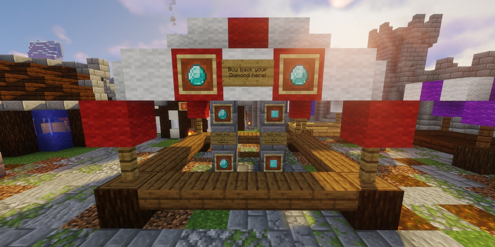
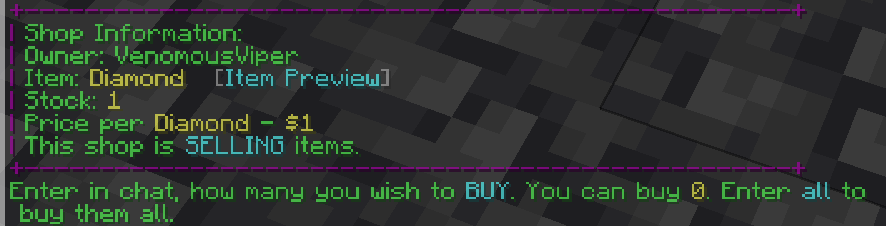
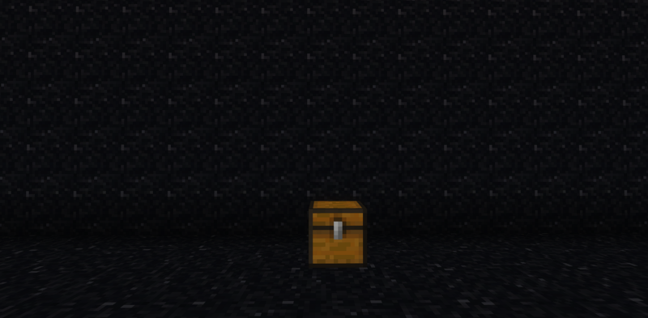
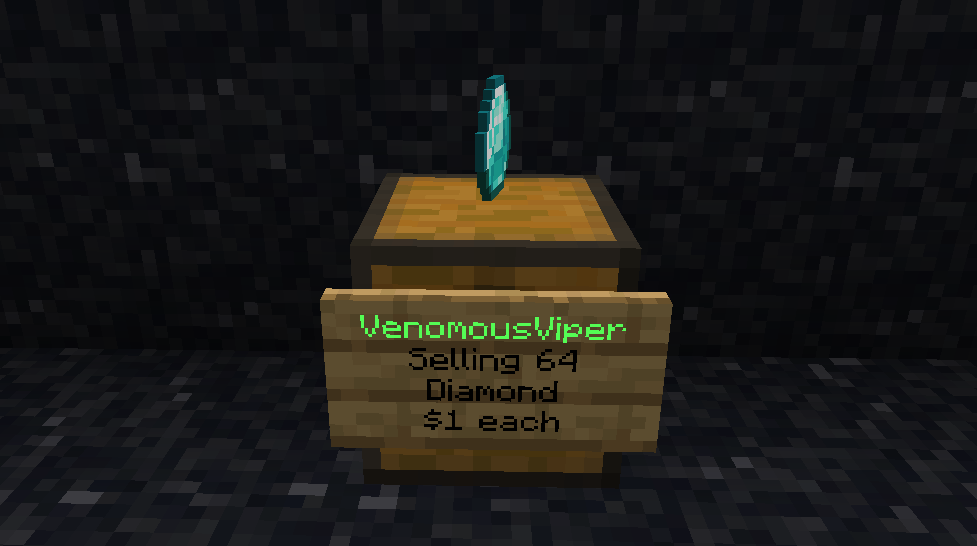
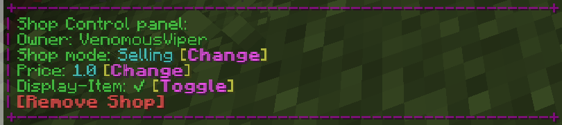
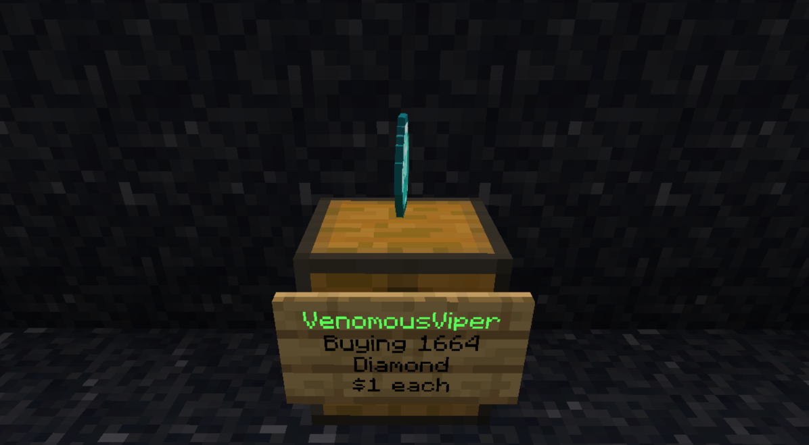
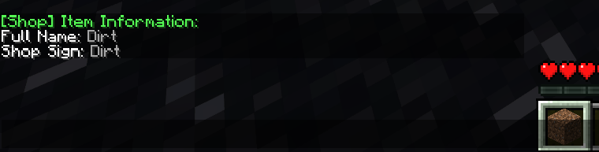

import Persona from '@site/src/components/Persona';

# Shops & Economy

<Persona who="ned">
  Ask before you build. Neighbours remember.
</Persona>

**Overview:**
Survival has a player-run economy. You earn currency by playing, then spend it at other players' chest shops, or set up a shop of your own to buy and sell items.

This guide walks you through everything in one place: how currency works, using a shop, creating and managing your own, removing it, and finding shops with the Shop Directory.

### How Currency Works

Our server uses Diamonds as currency, on a simple 1-to-1 basis: 1 Diamond = $1.

This is a true survival economy:

* All currency is earned in-game (mining, farming, trading).
* No one can buy currency or items with real money.
* Prices are set by players, not the server.

This keeps the economy balanced and ensures fair play for everyone.

**Getting Currency:**

1. Find and mine Diamonds.
2. Use `/sell Diamond`, or hold your Diamonds and use `/sell hand`.
3. You'll get a message confirming your balance has been updated.

**Checking Your Balance:** Use `/bal` or `/balance`.

**Getting Your Diamonds Back:**
Go to spawn and find the Admin Shop, where you can buy Diamonds back using your balance.



### Using a Shop

:::warning

When we talk about funds and purchases at Player Chest Shops, this always means in-game currency. You cannot use real money to get in-game currency.

:::

1. Check you have enough funds with `/bal`.
2. Go up to the shop's chest and left-click the sign.
3. The shop will ask you in chat how many items you want. Type the number.
4. Your items are traded straight away.



### Creating Your Own Shop

1. Place a chest where you want your shop.

   

2. **Look at the chest and run the create command:**
   * Holding the item in your hand: `/qs create [price]`
   * Not holding the item: `/qs create [price] [item]`

   The price is per item.

3. **Check the sign.** If the shop was set up correctly, a shop sign appears on the front of the chest showing your name, what the shop is doing, the item and the price.

   

   *This shop is selling 64 Diamonds at $1 each.*

4. **Stock your shop.** For a selling shop, put the items you're selling in the chest.

### Managing Your Shop

**Shop Settings Menu:**
Right-click your shop sign to open the Shop Control panel in chat. From here you can change the shop mode, change the price, toggle the floating display item, or remove the shop.



**Shop Modes:**
Look at your shop sign and use:

* `/qs sell` – Selling shop. Other players buy items from you. You earn money.
* `/qs buy` – Buying shop. Other players sell items to you. They're paid from your balance.



*This shop is buying up to 1664 Diamonds at $1 each.*

**Changing the Price:**
Look at your shop sign and use `/qs price [new price]`.

**Example:**
To change your shop's price to $5 each: `/qs price 5`

### Removing a Shop

**Commands:**

* `/qs remove` – Removes the shop you're looking at. Look directly at the shop's sign or chest first.
* `/qs removeall` – Removes all of your shops.

After removing a shop, you can break the chest as normal.

### Finding Shops: The Shop Directory

The Shop Directory lets you search every Player Chest Shop on Survival by item, without walking around to find them.

**On the Website:**
Go to [craftingforchrist.net/shopdirectory](https://craftingforchrist.net/shopdirectory) and search by Material (the item being bought or sold, minimum 2 characters).

Each result shows the seller's username, item quantity, price, stock status, and the shop's in-game coordinates so you can go straight to it.

**In Discord:**

```
/shopdirectory material:<item> [type:buying|selling]
```

Results appear as a paginated embed, up to 8 shops per page, with the same seller, price, stock and coordinate info as the website. Use the buttons to page through results.

The directory pulls live data directly from shops set up in-game. There is no separate in-game command for it.

### Shopping District Rules

The Shopping District only works if it stays a shopping district. These are the rules that keep it worth walking through.

#### Pick a theme and stick to it

Your shop should sell one type of item, or offer one kind of service, and be built around that. Variety shops that sell a bit of everything aren't allowed. They make the district impossible to navigate, and they undercut the people who specialise.

#### Only shops go in the district

No bases, no farms, no general builds. If you want somewhere to live, build it outside. Shops built outside the district may be removed too, so keep yours inside.

#### Don't block your neighbours

You can build anywhere in the district that's free. The one thing you can't do is wall off the shops either side of you. People need to be able to reach them.

#### Your signs must be honest

A sign has to reflect what's actually being bought or sold, at the price shown. A shop that misleads people is treated as a scam, not a mistake.

#### Giving things away is fine, free shops aren't

Donation chests, trashcan chests and giveaways are welcome. What isn't allowed is a shop selling items for nothing in any real quantity, because it drags prices out from under everyone else.

#### Restock now and then

If a shop sits mostly sold out for more than 60 days, Staff may remove it to free the space for someone else. Topping it up occasionally is all it takes to keep your spot.

:::info Competition is welcome

Several shops selling the same item is healthy for the economy. Price each other fairly and let players choose.

:::

### Shopping District Etiquette

* **Respect Shops:** Don't block or grief shops in the Shopping District.
* **Avoid Price Gouging:** You're free to set your own prices, but reasonable pricing keeps the economy healthy.
* **Be Honest:** Don't scam other players in direct trades. Scams may be punished by staff.

### Troubleshooting & Common Issues

* **Not Sure What to Call Your Item:** Hold the item in your hand and use `/qs create [price]`. The shop picks up the item for you.

  

* **Can't Buy From a Shop:** Check you have enough funds with `/bal`.
* **Shop Isn't in the Shop Directory:** Make sure it was created properly with `/qs create` and that a shop sign appeared on the chest.
* **Wrong Shop Mode:** Look at the sign and use `/qs sell` or `/qs buy` to switch.
* **Need to Change the Price:** Look at the sign and use `/qs price [new price]`.
