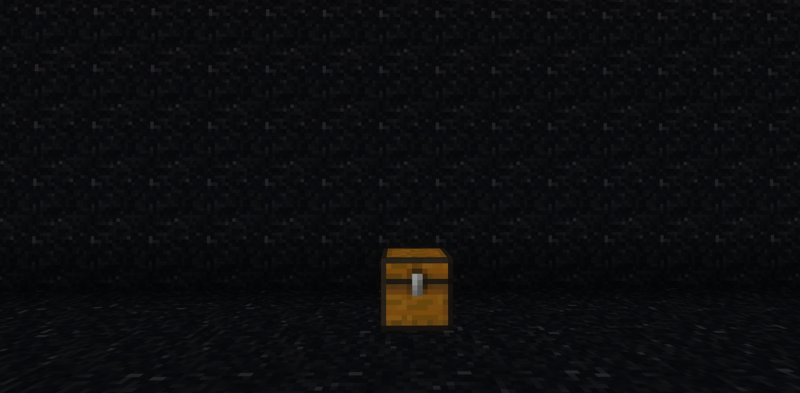
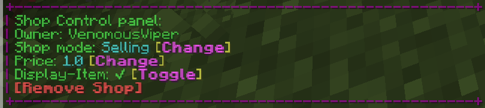
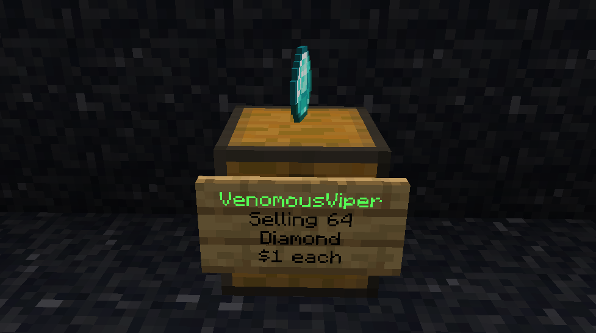
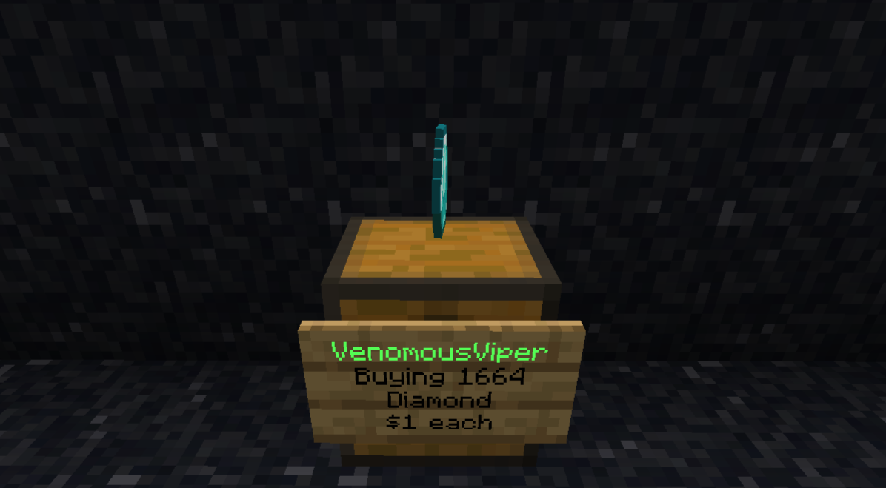

# Create a Player Chest Shop
Follow these steps to create your shop successfully:

# Place a Chest
Start by placing a chest on the ground in your desired location.

# Run /qs create [price] [item]
Run the command `/qs create [price][item]`. Alternatively, if you hold the item in your hand you only need the price: `/qs create [price]`.

:::info

For instance, in Fig 1: The shop is selling 64 diamonds at $1 each.

:::
# Shop Settings
 If you Right-Click the shop sign you will see a menu pop up in chat that displays 
 
# Shop Modes
To switch between selling or buying items look at the shop sign and type `/qs buy` or `/qs sell` respectively.

Below are examples of the different modes:

This format is an example of a shop where you can sell items to earn money.
 

This format is an example of a shop where players can sell you items in exchange for money from your balance.

# Changing the Price
If you wish to change the price of your shop after you have created it, type `/qs price [new price]`.

## Confirmation
If you've set up your shop correctly, you should see a shop sign appear in front of the chest.

# I am having issues what to call my shop item.
**Trouble Naming Items:** If you're unsure about how to name an item on the sign in your shop, you can hold the item in your hand while you use `/qs create [price]` to create your shop

With these steps, you'll be well on your way to successfully creating and managing your shop in the game. Happy trading!
