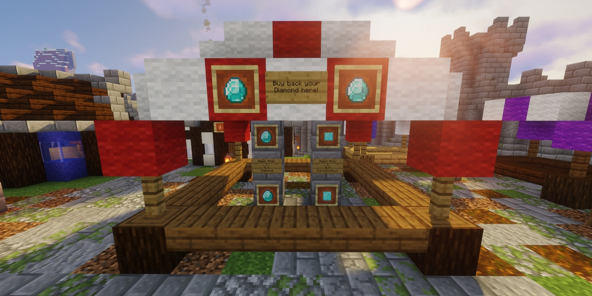

# Introduction to Currency
In the Economy Update on our Survival Server, we've introduced a shop/economy system that empowers players to establish shops and engage in the exchange of goods and services.

Our server employs Diamonds as the primary currency. The system operates on a straightforward 1-to-1 basis, where 1 Diamond is equivalent to 1 dollar.

## Obtaining Currency
To acquire currency for use in the economy, follow these steps:

* **Find Diamonds:** Your first task is to locate Diamonds in the game world and mine them.

* **Sell Diamonds:** Once you've gathered Diamonds, use the command `/sell Diamond` or `/sell hand`. You'll receive a notification confirming that your balance has been updated with the corresponding amount.

## Exchanging Diamonds
You may find that you want to obtain your Diamonds back from your balance to use. To do this you will need to go to spawn. From there you can find an Admin Shop setup where you can buy back Diamonds from your balance.

This system ensures a vibrant player-driven economy on our server, allowing you to both earn and spend Diamonds for various in-game activities. Enjoy your time on the server and make the most of this exciting new feature!

