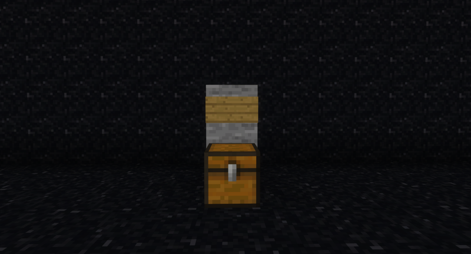

# Create a Player Chest Shop
Follow these steps to create your shop successfully:

# Place a Chest
Start by placing a chest on the ground in your desired location.


# Position the Sign
Position a sign one block away from the chest. 

:::info

In the example screenshot, it has been placed directly above the chest for clarity.

:::



# Sign Format
On the sign above the chest, use the following format:

```
[Your Username]
[Amount to Buy/Sell per Transaction]
[Buy Price - Sell Price]
[Item ID/Name]
```

:::info

For instance, in Fig 1: Buying 1 Diamond for $10 and selling 1 Diamond for $5.

:::


This format is an example for buying and selling an item.
 


This format is an example for just selling an item.

## Confirmation Message
If you've set up your shop correctly, you should receive a message in the chat confirming that your shop has been successfully created, such as "Shop successfully created!"

# I am having issues what to call my shop item.
**Trouble Naming Items:** If you're unsure about how to name an item on the sign in your shop, you can use the `/iteminfo` command. This command helps you identify the item's name and what to put on the shop sign.


In this example Dirt is being used the item and the name of the item to be used on the Shop Sign.

# Shop Sign Breakdown
* The first line should contain your username.
* The second line specifies the amount of items to buy or sell per transaction.
  * For example, in Fig 1: Buying 1 Diamond for $10 and selling 1 Diamond for $5.
* The third line combines buy and sell prices and should include a price indicator (B for buy price, S for sell price) near the prices, separated by a colon (e.g., B:$10 - S:$5).
* The fourth line should hold the item's ID or name.

If you ever get stuck during this process, you can simply write a "?" on the sign, and the item will be automatically filled from the chest, or you can click on the sign with the item in hand afterward.

With these steps, you'll be well on your way to successfully creating and managing your shop in the game. Happy trading!