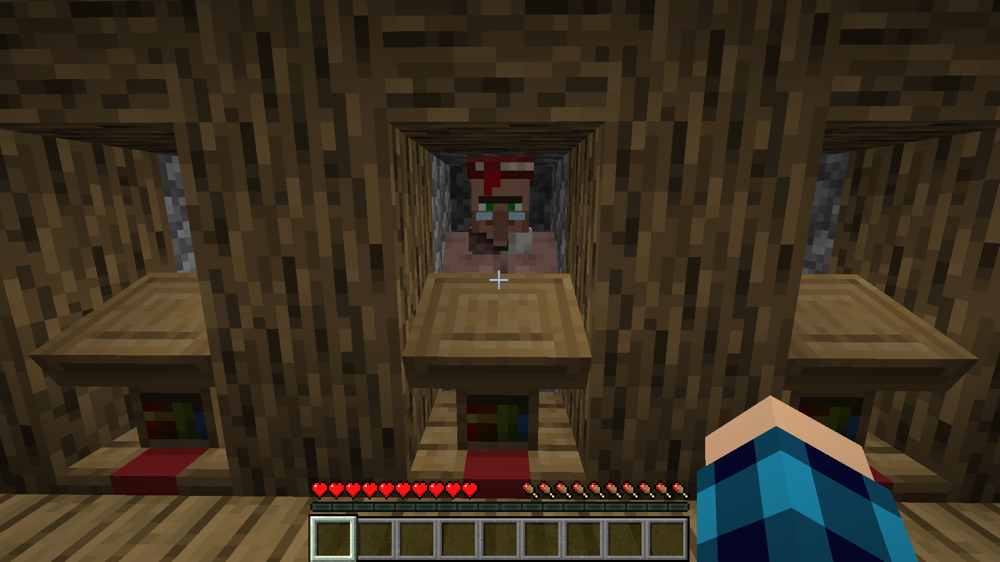
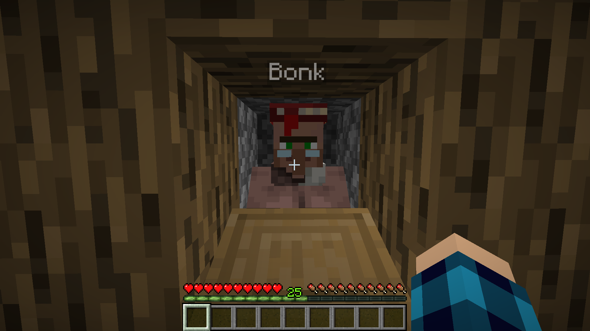
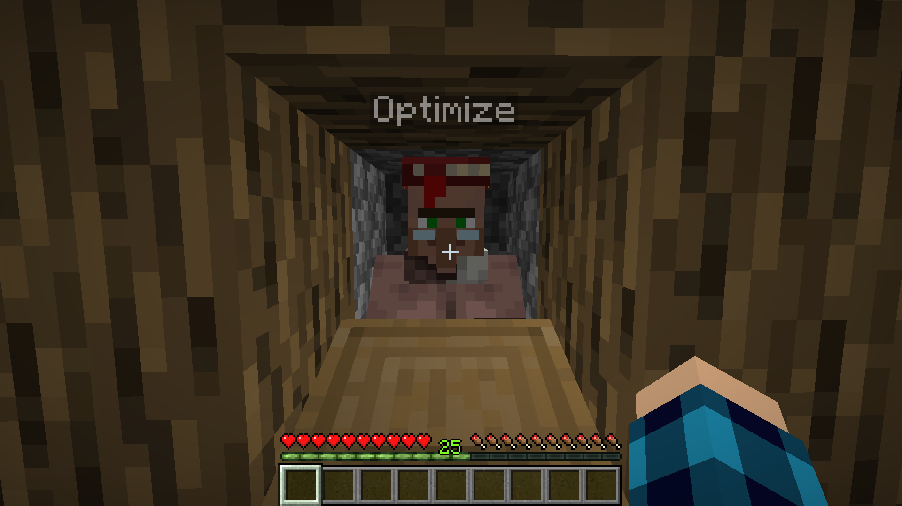

# How to Disable Villager AI
Disabling your villagers' AI can reduce their impact on server performance. This will stop the villagers from moving, getting frightened, sleeping, or changing workstations. You can still trade with these villagers, they will still automatically restock twice a day, and still unlock trades if they are not at Master Level. 

:::warning
Please Note: Disabling villagers' AI will stop them from spawning iron golems. This feature is designed for use in trading halls.

:::

:::info
We are still testing this plugin. If any issues arise please let a staff member know.

:::
# Before Disabling their AI
Before disabling the villager ai, ensure your villager is in a safe location like. (You can undo this later but there is a cooldown). 

# Disabiling Villager AI
Once the villager is in the desired location you can use a nametag to name them `Bonk` or `Optimize`. Unlike renaming other mobs, this will not consume the nametag!

Using Bonk:

Using Optimize:

Success! Your villager's AI is now disabled!
# Enabling Villager AI

If you need to move your villager, or otherwise need their AI enabled, simply, rename the villager to anything else! Note: There is a 10-minute cooldown on renaming villagers.
